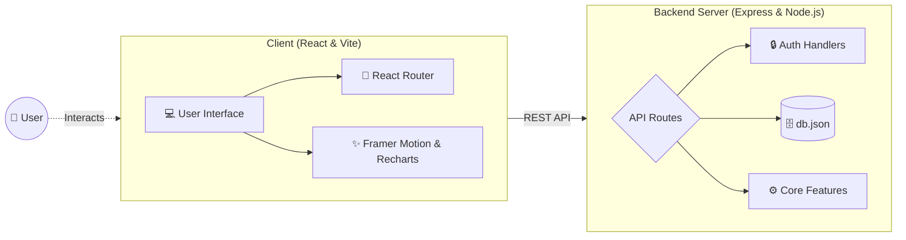

<div align="center">
  <h1>Skill-Up-Connect</h1>
  <p><em>Bridging the gap between learning and career growth — empowering you to upskill and land your dream role.</em></p>
  <p>
    
    
    
  </p>
</div>

<hr />

## 📖 Overview

Skill-Up-Connect is a comprehensive, interactive platform designed to integrate skills assessment, personalized learning paths, an interactive resume builder, and a dedicated jobs portal into one seamless experience.

## 🚀 Key Features

### 1. 📊 Personalized Dashboard & Tracking

Monitor your learning progress and activities with interactive visual tools:

- **Interactive Charts:** Visualize your learning journey with dynamic graphs built using Recharts.
- **Activity Monitoring:** Keep a detailed log of your recent accomplishments and ongoing modules.

### 2. 🧠 Dynamic Skills Assessment

Evaluate your current knowledge and receive targeted, insightful feedback:

- **Interactive Quizzes:** Test your proficiency across various domains and skill sets.
- **Detailed Results:** Get comprehensive feedback to identify your strengths and areas for improvement.

### 3. 🛣️ Custom Learning Paths

Master new domains with tailored educational content and resources:

- **Curated Modules:** Follow structured courses designed to build your expertise step-by-step.
- **Goal-Oriented Learning:** Focus on the exact skills you need to achieve your career objectives.

### 4. 📄 Interactive Resume Builder

Create and export a professional resume right within the platform:

- **Integrated Creator:** Input your skills, experience, and education seamlessly.
- **PDF Export:** Download a polished, ready-to-share resume powered by `jspdf` and `html2canvas`.

### 5. 💼 Dedicated Jobs Portal

Connect with your dream roles and potential employers:

- **Job Discovery:** Browse the latest opportunities that perfectly match your newly acquired skills.
- **Career Growth:** Find the right roles to accelerate your upskilling efforts.

### 6. 🎨 Modern & Intuitive UI

Built with a strong focus on an engaging and rewarding user experience:

- **Smooth Animations:** Enjoy high-quality micro-interactions and page transitions powered by Framer Motion.
- **Gamified Elements:** Celebrate your milestones and completed assessments with fun Confetti effects!

## 🛠️ Tech Stack

| Layer | Technology |
| :--- | :--- |
| 🌐 Frontend | React 19, Vite |
| 🎨 Styling & Animation | Framer Motion, Lucide React |
| 🧭 Routing | React Router DOM |
| 📊 Data Visualization | Recharts |
| ⚙️ Backend | Node.js, Express (`server.cjs`) |
| 🧰 Utilities | `jspdf`, `html2canvas`, `canvas-confetti` |

## 🏗️ Project Architecture



## 🛠️ Installation & Setup

Follow these steps to set up the project locally on your machine.

### 🔗 Prerequisites

- Node.js (v18+)
- npm

### 1. Clone the Repository

```bash
git clone https://github.com/anureddyb20/Skill-Up-Connect.git
cd Skill-Up-Connect
```

### 2. Install Dependencies

```bash
npm install
```

### 3. Start the Development Server

You can run both the frontend (Vite) and backend (Express) concurrently using a single command:

```bash
npm run dev:all
```

Alternatively, you can run them separately:

```bash
npm run dev       # Starts the Vite frontend server
npm run server    # Starts the Node/Express backend server
```

### 4. Build for Production

```bash
npm run build
```

## 🎯 Manual Usage

If you'd like to run the app locally and explore the features:

1. **Environment Setup:** Ensure your dependencies are installed and your local backend is ready.
2. **Launch App:** Run `npm run dev:all` to start both the Vite development server and the Express backend.
3. **Explore the Platform:**
   - **Skill-Up-Connect Dashboard:** `http://localhost:5173`

## 🌍 Impact

<hr />

The gap between theoretical knowledge and practical application often hinders **countless talented individuals** from landing their dream roles. **Skill-Up-Connect** aims to bridge this gap by seamlessly integrating skills assessment, personalized learning paths, and an interactive resume builder, accelerating career growth and fostering a more capable workforce.

<br />
<hr />

<div align="center">
  <p>Built with a vision for Continuous Learning & Professional Growth by <b>Team Vulpine Vision</b></p>
</div>
